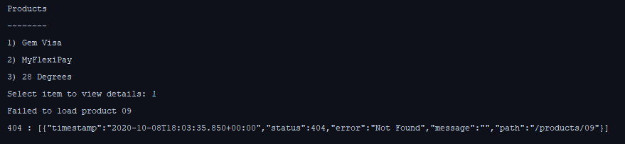

# Example Spring Boot project for the Pact workshop

This workshop should take about 2 hours, depending on how deep you want to go into each topic.

This workshop is setup with a number of steps that can be run through. Each step is in a branch, so to run through a
step of the workshop just check out the branch for that step (i.e. `git checkout step1`).

## Requirements

* JDK 8+
* Docker for step 11

## Workshop outline:

* [step 1: **Simple Consumer calling Provider**](https://github.com/pact-foundation/pact-workshop-jvm-spring/tree/step1#step-1---simple-consumer-calling-provider)
* [step 2: **Client Tested but integration fails**](https://github.com/pact-foundation/pact-workshop-jvm-spring/tree/step2#step-2---client-tested-but-integration-fails)
* [step 3: **Pact to the rescue**](https://github.com/pact-foundation/pact-workshop-jvm-spring/tree/step3#step-3---pact-to-the-rescue)
* [step 4: **Verify the provider**](https://github.com/pact-foundation/pact-workshop-jvm-spring/tree/step4#step-4---verify-the-provider)
* [step 5: **Back to the client we go**](https://github.com/pact-foundation/pact-workshop-jvm-spring/tree/step5#step-5---back-to-the-client-we-go)
* [step 6: **Consumer updates contract for missing products**](https://github.com/pact-foundation/pact-workshop-jvm-spring/tree/step6#step-6---consumer-updates-contract-for-missing-products)
* [step 7: **Adding the missing states**](https://github.com/pact-foundation/pact-workshop-jvm-spring/tree/step7#step-7---adding-the-missing-states)
* [step 8: **Authorization**](https://github.com/pact-foundation/pact-workshop-jvm-spring/tree/step8#step-8---authorization)
* [step 9: **Implement authorisation on the provider**](https://github.com/pact-foundation/pact-workshop-jvm-spring/tree/step9#step-9---implement-authorisation-on-the-provider)
* [step 10: **Request Filters on the Provider**](https://github.com/pact-foundation/pact-workshop-jvm-spring/tree/step10#step-10---request-filters-on-the-provider)
* [step 11: **Using a Pact Broker**](https://github.com/pact-foundation/pact-workshop-jvm-spring/tree/step11#step-11---using-a-pact-broker)

_NOTE: Each step is tied to, and must be run within, a git branch, allowing you to progress through each stage incrementally. For example, to move to step 2 run the following: git checkout step2_

## Scenario

There are two components in scope for our workshop.

1. Product Catalog application (Consumer). It provides a console interface to query the Product service for product information.
1. Product Service (Provider). Provides useful things about products, such as listing all products and getting the details of an individual product.

## Step 1 - Simple Consumer calling Provider

We need to first create an HTTP client to make the calls to our provider service:


The Consumer has implemented the product service client which has the following:

- `GET /products` - Retrieve all products
- `GET /products/{id}` - Retrieve a single product by ID

The diagram below highlights the interaction for retrieving a product with ID 10:


You can see the client interface we created in `consumer/src/main/au/com/dius/pactworkshop/consumer/ProductService.java`:

```java
@Service
public class ProductService {

    private final RestTemplate restTemplate;

    @Autowired
    public ProductService(RestTemplate restTemplate) {
        this.restTemplate = restTemplate;
    }

    public List<Product> getAllProducts() {
        return restTemplate.exchange("/products",
                HttpMethod.GET,
                null,
                new ParameterizedTypeReference<List<Product>>(){}).getBody();
    }

    public Product getProduct(String id) {
        return restTemplate.getForEntity("/products/{id}", Product.class, id).getBody();
    }
}
```

We can run the client with `./gradlew consumer:bootRun` - it should fail with the error below, because the Provider is not running.

```console
Caused by: org.springframework.web.client.ResourceAccessException: I/O error on GET request for "http://localhost:8085/products": Connection refused: connect; nested exception is java.net.ConnectException: Connection refused: connect
```

Move on to [step 2](https://github.com/pact-foundation/pact-workshop-jvm-spring/tree/step2#step-2---client-tested-but-integration-fails)

## Step 2 - Client Tested but integration fails

Now let's create a basic test for our API client. We're going to check 2 things:

1. That our client code hits the expected endpoint
1. That the response is marshalled into an object that is usable, with the correct ID

You can see the client interface test we created in `consumer/src/test/java/au/com/dius/pactworkshop/consumer/ProductServiceTest.java`:

```java
class ProductServiceTest {

  private WireMockServer wireMockServer;
  private ProductService productService;

  @BeforeEach
  void setUp() {
    wireMockServer = new WireMockServer(options().dynamicPort());

    wireMockServer.start();

    RestTemplate restTemplate = new RestTemplateBuilder()
      .rootUri(wireMockServer.baseUrl())
      .build();

    productService = new ProductService(restTemplate);
  }

  @AfterEach
  void tearDown() {
    wireMockServer.stop();
  }

  @Test
  void getAllProducts() {
    wireMockServer.stubFor(get(urlPathEqualTo("/products"))
      .willReturn(aResponse()
        .withStatus(200)
        .withHeader("Content-Type", "application/json")
        .withBody("[" +
          "{\"id\":\"9\",\"type\":\"CREDIT_CARD\",\"name\":\"GEM Visa\",\"version\":\"v2\"},"+
          "{\"id\":\"10\",\"type\":\"CREDIT_CARD\",\"name\":\"28 Degrees\",\"version\":\"v1\"}"+
          "]")));

    List<Product> expected = Arrays.asList(new Product("9", "CREDIT_CARD", "GEM Visa", "v2"),
      new Product("10", "CREDIT_CARD", "28 Degrees", "v1"));

    List<Product> products = productService.getAllProducts();

    assertEquals(expected, products);
  }

  @Test
  void getProductById() {
    wireMockServer.stubFor(get(urlPathEqualTo("/products/50"))
      .willReturn(aResponse()
        .withStatus(200)
        .withHeader("Content-Type", "application/json")
        .withBody("{\"id\":\"50\",\"type\":\"CREDIT_CARD\",\"name\":\"28 Degrees\",\"version\":\"v1\"}")));

    Product expected = new Product("50", "CREDIT_CARD", "28 Degrees", "v1");

    Product product = productService.getProduct("50");

    assertEquals(expected, product);
  }
}
```


Let's run this test and see it all pass:

```console
> ./gradlew consumer:test

BUILD SUCCESSFUL in 2s
```

Meanwhile, our provider team has started building out their API in parallel. Let's run our website against our provider (you'll need two terminals to do this):


```console
# Terminal 1
❯ ./gradlew provider:bootRun

...
...
Tomcat started on port(s): 8085 (http) with context path ''
Started ProviderApplication in 1.67 seconds (JVM running for 2.039)
```

```console
# Terminal 2
> ./gradlew consumer:bootRun --console plain

...
...
Started ConsumerApplication in 1.106 seconds (JVM running for 1.62)


Products
--------
1) Gem Visa
2) MyFlexiPay
3) 28 Degrees
Select item to view details: 
```

You should now see 3 different products. Choosing an index number should display detailed product information.

Let's see what happens!



Doh! We are getting 404 every time we try to view detailed product information. On closer inspection, the provider only knows about `/product/{id}` and `/products`.

We need to have a conversation about what the endpoint should be, but first...

Move on to [step 3](https://github.com/pact-foundation/pact-workshop-jvm-spring/tree/step3#step-3---pact-to-the-rescue)

## Step 3 - Pact to the rescue

Unit tests are written and executed in isolation of any other services. When we write tests for code that talk to other services, they are built on trust that the contracts are upheld. There is no way to validate that the consumer and provider can communicate correctly.

> An integration contract test is a test at the boundary of an external service verifying that it meets the contract expected by a consuming service — [Martin Fowler](https://martinfowler.com/bliki/IntegrationContractTest.html)

Adding contract tests via Pact would have highlighted the `/product/{id}` endpoint was incorrect.

Let us add Pact to the project and write a consumer pact test for the `GET /products/{id}` endpoint.

*Provider states* is an important concept of Pact that we need to introduce. These states help define the state that the provider should be in for specific interactions. For the moment, we will initially be testing the following states:

- `product with ID 10 exists`
- `products exist`

The consumer can define the state of an interaction using the `given` property.

Note how similar it looks to our unit test:

In `consumer/src/test/java/au/com/dius/pactworkshop/consumer/ProductConsumerPactTest.java`:

```java
@ExtendWith(PactConsumerTestExt.class)
public class ProductConsumerPactTest {
  
      @Pact(consumer = "FrontendApplication", provider = "ProductService")
      RequestResponsePact getAllProducts(PactDslWithProvider builder) {
        return builder.given("products exist")
          .uponReceiving("get all products")
          .method("GET")
          .path("/products")
          .willRespondWith()
          .status(200)
          .headers(headers())
          .body(newJsonArrayMinLike(2, array ->
            array.object(object -> {
              object.stringType("id", "09");
              object.stringType("type", "CREDIT_CARD");
              object.stringType("name", "Gem Visa");
            })
          ).build())
          .toPact();
      }
    
      @Pact(consumer = "FrontendApplication", provider = "ProductService")
      RequestResponsePact getOneProduct(PactDslWithProvider builder) {
        return builder.given("product with ID 10 exists")
          .uponReceiving("get product with ID 10")
          .method("GET")
          .path("/products/10")
          .willRespondWith()
          .status(200)
          .headers(headers())
          .body(newJsonBody(object -> {
            object.stringType("id", "10");
            object.stringType("type", "CREDIT_CARD");
            object.stringType("name", "28 Degrees");
          }).build())
          .toPact();
      }
    
      @Test
      @PactTestFor(pactMethod = "getAllProducts")
      void getAllProducts_whenProductsExist(MockServer mockServer) {
        Product product = new Product();
        product.setId("09");
        product.setType("CREDIT_CARD");
        product.setName("Gem Visa");
        List<Product> expected = Arrays.asList(product, product);
    
        RestTemplate restTemplate = new RestTemplateBuilder()
          .rootUri(mockServer.getUrl())
          .build();
        List<Product> products = new ProductService(restTemplate).getAllProducts();
    
        assertEquals(expected, products);
      }
    
      @Test
      @PactTestFor(pactMethod = "getOneProduct")
      void getProductById_whenProductWithId10Exists(MockServer mockServer) {
        Product expected = new Product();
        expected.setId("10");
        expected.setType("CREDIT_CARD");
        expected.setName("28 Degrees");
    
        RestTemplate restTemplate = new RestTemplateBuilder()
          .rootUri(mockServer.getUrl())
          .build();
        Product product = new ProductService(restTemplate).getProduct("10");
    
        assertEquals(expected, product);
      }
    
      private Map<String, String> headers() {
        Map<String, String> headers = new HashMap<>();
        headers.put("Content-Type", "application/json; charset=utf-8");
        return headers;
      }
}
```


This test starts a mock server on a random port that acts as our provider service. To get this to work we update the URL in the `Client` that we create, after initialising Pact.

To run only the Pact tests:

```console
> ./gradlew consumer:test --tests *PactTest

```

Running this test still passes, but it creates a pact file which we can use to validate our assumptions on the provider side, and have conversation around.

```console
❯ ./gradlew consumer:test --tests *PactTest
  
  BUILD SUCCESSFUL in 6s
```

A pact file should have been generated in *consumer/build/pacts/FrontendApplication-ProductService.json*

*NOTE*: even if the API client had been graciously provided for us by our Provider Team, it doesn't mean that we shouldn't write contract tests - because the version of the client we have may not always be in sync with the deployed API - and also because we will write tests on the output appropriate to our specific needs.

Move on to [step 4](https://github.com/pact-foundation/pact-workshop-jvm-spring/tree/step4#step-4---verify-the-provider)

## Step 4 - Verify the provider

We will need to copy the Pact contract file that was produced from the consumer test into the Provider module. This will help us verify that the provider can meet the requirements as set out in the contract.

Copy the contract located in `consumer/build/pacts/FrontendApplication-Productservice.json` to `provider/src/test/resources/pacts/FrontendApplication-Productservice.json`. Or run the Gradle task
```console
> ./gradlew consumer:copyPacts

BUILD SUCCESSFUL in 1s
```

Now let's make a start on writing Pact tests to validate the consumer contract:

In `provider/src/test/java/au/com/dius/pactworkshop/provider/ProductPactProviderTest.java`:

```java
@Provider("ProductService")
@PactFolder("pacts")
@ExtendWith(SpringExtension.class)
@SpringBootTest(webEnvironment = SpringBootTest.WebEnvironment.RANDOM_PORT)
public class ProductPactProviderTest {

    @LocalServerPort
    int port;

    @BeforeEach
    void setUp(PactVerificationContext context) {
        context.setTarget(new HttpTestTarget("localhost", port));
    }

    @TestTemplate
    @ExtendWith(PactVerificationInvocationContextProvider.class)
    void verifyPact(PactVerificationContext context) {
        context.verifyInteraction();
    }

    @State("products exist")
    void toProductsExistState() {

    }

    @State("product with ID 10 exists")
    void toProductWithIdTenExistsState() {

    }
}
```

To run only the verification tests:

```console
> ./gradlew provider:test --tests *Pact*Test
```

We now need to validate the pact generated by the consumer is valid, by executing it against the running service provider, which should fail:

```console
❯ ./gradlew provider:test --tests *Pact*Test

...
...
au.com.dius.pactworkshop.provider.ProductPactProviderTest > FrontendApplication - get product with ID 10 FAILED
    java.lang.AssertionError at ProductPactProviderTest.java:33
2020-10-09 06:21:52.555  INFO 6404 --- [extShutdownHook] o.s.s.concurrent.Thread
2 tests completed, 1 failed

> Task :provider:test FAILED
```


The test has failed, as the expected path `/products/{id}` is returning 404. We incorrectly believed our provider was following a RESTful design, but the authors were too lazy to implement a better routing solution 🤷🏻‍♂️.

The correct endpoint which the consumer should call is `/product/{id}`.

Move on to [step 5](https://github.com/pact-foundation/pact-workshop-jvm-spring/tree/step5#step-5---back-to-the-client-we-go)

## Step 5 - Back to the client we go

We now need to update the consumer client and tests to hit the correct product path.

First, we need to update the GET route for the client:

In `consumer/src/main/au/com/dius/pactworkshop/consumer/ProductService.java`:

```java
...

public Product getProduct(String id) {
    return restTemplate.getForEntity("/product/{id}", Product.class, id).getBody();
}
```

Then we need to update the Pact test `ID 10 exists` to use the correct endpoint in `path`.

In `consumer/src/test/java/au/com/dius/pactworkshop/consumer/ProductConsumerPactTest.java`:

```java
@Pact(consumer = "FrontendApplication", provider = "ProductService")
RequestResponsePact getOneProduct(PactDslWithProvider builder) {
    return builder.given("product with ID 10 exists")
            .uponReceiving("get product with ID 10")
            .method("GET")
            .path("/product/10")
            .willRespondWith()
            .status(200)
            .headers(headers())
            .body(newJsonBody(object -> {
                object.stringType("id", "10");
                object.stringType("type", "CREDIT_CARD");
                object.stringType("name", "28 Degrees");
            }).build())
            .toPact();
}
...
```


Let's run and generate an updated pact file on the client:

```console
❯ ./gradlew consumer:test --tests *PactTest
  
  BUILD SUCCESSFUL in 7s
```


Now we run the provider tests again with the updated contract

Copy the updated contract located in `consumer/build/pacts/FrontendApplication-ProductService.json` to `provider/src/test/resources/pacts/FrontendApplication-Productservice.json` by running the command:
```console
> ./gradlew consumer:copyPacts
  
  BUILD SUCCESSFUL in 1s
```

Run the command:

```console
❯ ./gradlew provider:test --tests *Pact*Test

...
...

BUILD SUCCESSFUL in 10s
```

Yay - green ✅!

Move on to [step 6](https://github.com/pact-foundation/pact-workshop-jvm-spring/tree/step6#step-6---consumer-updates-contract-for-missing-products)

## Step 6 - Consumer updates contract for missing products

We're now going to add 2 more scenarios for the contract

- What happens when we make a call for a product that doesn't exist? We assume we'll get a `404`.

- What happens when we make a call for getting all products but none exist at the moment? We assume a `200` with an empty array.

Let's write a test for these scenarios, and then generate an updated pact file.

In `consumer/src/test/java/au/com/dius/pactworkshop/consumer/ProductConsumerPactTest.java`:

```java
    @Pact(consumer = "FrontendApplication", provider = "ProductService")
    RequestResponsePact noProductsExist(PactDslWithProvider builder) {
        return builder.given("no products exist")
                .uponReceiving("get all products")
                .method("GET")
                .path("/products")
                .willRespondWith()
                .status(200)
                .headers(headers())
                .body("[]")
                .toPact();
    }

    @Pact(consumer = "FrontendApplication", provider = "ProductService")
    RequestResponsePact productDoesNotExist(PactDslWithProvider builder) {
        return builder.given("product with ID 11 does not exist")
                .uponReceiving("get product with ID 11")
                .method("GET")
                .path("/product/11")
                .willRespondWith()
                .status(404)
                .toPact();
    }

    @Test
    @PactTestFor(pactMethod = "noProductsExist")
    void getAllProducts_whenNoProductsExist(MockServer mockServer) {
        RestTemplate restTemplate = new RestTemplateBuilder()
                .rootUri(mockServer.getUrl())
                .build();
        List<Product> products = new ProductService(restTemplate).getAllProducts();

        assertEquals(Collections.emptyList(), products);
    }

    @Test
    @PactTestFor(pactMethod = "productDoesNotExist")
    void getProductById_whenProductWithId11DoesNotExist(MockServer mockServer) {
        RestTemplate restTemplate = new RestTemplateBuilder()
                .rootUri(mockServer.getUrl())
                .build();

        HttpClientErrorException e = assertThrows(HttpClientErrorException.class,
                () -> new ProductService(restTemplate).getProduct("11"));
        assertEquals(404, e.getRawStatusCode());
    }
```

Notice that our new tests look almost identical to our previous tests, and only differ on the expectations of the _response_ - the HTTP request expectations are exactly the same.

```console
❯ ./gradlew consumer:test --tests *PactTest
  
  BUILD SUCCESSFUL in 1s
```

What does our provider have to say about this new test. Again, copy the updated pact file into the provider's pact directory:

```console
> ./gradlew consumer:copyPacts
  
  BUILD SUCCESSFUL in 1s
```

and run the command:

```console
❯ ./gradlew provider:test --tests *Pact*Test

...
...

au.com.dius.pactworkshop.provider.ProductPactProviderTest > FrontendApplication - get all products FAILED
    java.lang.AssertionError at ProductPactProviderTest.java:33

au.com.dius.pactworkshop.provider.ProductPactProviderTest > FrontendApplication - get product with ID 11 FAILED
    java.lang.AssertionError at ProductPactProviderTest.java:33
2020-10-09 08:27:31.030  INFO 18048 --- [extShutdownHook] o.s.s.concurrent.Threa
4 tests completed, 2 failed

> Task :provider:test FAILED

FAILURE: Build failed with an exception.

```

We expected this failure, because the product we are requesting does in fact exist! What we want to test for, is what happens if there is a different *state* on the Provider. This is what is referred to as "Provider states", and how Pact gets around test ordering and related issues.

We could resolve this by updating our consumer test to use a known non-existent product, but it's worth understanding how Provider states work more generally.

Move on to [step 7](https://github.com/pact-foundation/pact-workshop-jvm-spring/tree/step7#step-7---adding-the-missing-states)

## Step 7 - Adding the missing states

Our code already deals with missing users and sends a `404` response, however our test data fixture always has product ID 10 and 11 in our database.

In this step, we will add state handlers to our provider Pact verifications, which will update the state of our data store depending on which states the consumers require.

States are invoked prior to the actual test function being invoked. You can see the full [lifecycle here](https://github.com/pact-foundation/pact-go#lifecycle-of-a-provider-verification).

We're going to add handlers for all our states:

- products exist
- no products exist
- product with ID 10 exists
- product with ID 11 does not exist

Let's open up our provider Pact verifications in `provider/src/test/java/au/com/dius/pactworkshop/provider/ProductPactProviderTest.java`:

```java
    @State("products exist")
    void toProductsExistState() {
      when(productRepository.fetchAll()).thenReturn(
          Arrays.asList(new Product("09", "CREDIT_CARD", "Gem Visa", "v1"),
              new Product("10", "CREDIT_CARD", "28 Degrees", "v1")));
    }

    @State({
            "no products exist",
            "product with ID 11 does not exist"
    })
    void toNoProductsExistState() {
        when(productRepository.fetchAll()).thenReturn(Collections.emptyList());
    }

    @State("product with ID 10 exists")
    void toProductWithIdTenExistsState() {
        when(productRepository.getById("10")).thenReturn(Optional.of(new Product("10", "CREDIT_CARD", "28 Degrees", "v1")));
    }
```

Let's see how we go now:

```console
❯ ./gradlew provider:test --tests *Pact*Test

BUILD SUCCESSFUL in 11s
```

_NOTE_: The states are not necessarily a 1 to 1 mapping with the consumer contract tests. You can reuse states amongst different tests. In this scenario we could have used `no products exist` for both tests which would have equally been valid.

Move on to [step 8](https://github.com/pact-foundation/pact-workshop-jvm-spring/tree/step8#step-8---authorization)

## Step 8 - Authorization

It turns out that not everyone should be able to use the API. After a discussion with the team, it was decided that a time-bound bearer token would suffice. The token must be in `yyyy-MM-ddTHHmm` format and within 1 hour of the current time.

In the case a valid bearer token is not provided, we expect a `401`. Let's update the consumer to pass the bearer token, and capture this new `401` scenario.

In `consumer/src/main/au/com/dius/pactworkshop/consumer/ProductService.java`:

```java
@Service
public class ProductService {

    private final RestTemplate restTemplate;

    @Autowired
    public ProductService(RestTemplate restTemplate) {
        this.restTemplate = restTemplate;
    }

    public List<Product> getAllProducts() {
        return restTemplate.exchange("/products",
                HttpMethod.GET,
                getRequestEntity(),
                new ParameterizedTypeReference<List<Product>>(){}).getBody();
    }

    public Product getProduct(String id) {
        return restTemplate.exchange("/product/{id}",
                HttpMethod.GET,
                getRequestEntity(),
                Product.class, id).getBody();
    }

    private HttpEntity<String> getRequestEntity() {
        HttpHeaders headers = new HttpHeaders();
        headers.add(HttpHeaders.AUTHORIZATION, generateAuthToken());
        return new HttpEntity<>(headers);
    }

    private String generateAuthToken() {
        return "Bearer " +  new SimpleDateFormat("yyyy-MM-dd'T'HH:mm").format(new Date());
    }
}
```

In `consumer/src/test/java/au/com/dius/pactworkshop/consumer/ProductConsumerPactTest.java`:

```java
@ExtendWith(PactConsumerTestExt.class)
public class ProductConsumerPactTest {

  @Pact(consumer = "FrontendApplication", provider = "ProductService")
  RequestResponsePact getAllProducts(PactDslWithProvider builder) {
    return builder.given("products exist")
      .uponReceiving("get all products")
      .method("GET")
      .path("/products")
      .matchHeader("Authorization", "Bearer (19|20)\\d\\d-(0[1-9]|1[012])-(0[1-9]|[12][0-9]|3[01])T([01][1-9]|2[0123]):[0-5][0-9]")
      .willRespondWith()
      .status(200)
      .headers(headers())
      .body(newJsonArrayMinLike(2, array ->
        array.object(object -> {
          object.stringType("id", "09");
          object.stringType("type", "CREDIT_CARD");
          object.stringType("name", "Gem Visa");
        })
      ).build())
      .toPact();
  }

  @Pact(consumer = "FrontendApplication", provider = "ProductService")
  RequestResponsePact noProductsExist(PactDslWithProvider builder) {
    return builder.given("no products exist")
      .uponReceiving("get all products")
      .method("GET")
      .path("/products")
      .matchHeader("Authorization", "Bearer (19|20)\\d\\d-(0[1-9]|1[012])-(0[1-9]|[12][0-9]|3[01])T([01][1-9]|2[0123]):[0-5][0-9]")
      .willRespondWith()
      .status(200)
      .headers(headers())
      .body("[]")
      .toPact();
  }

  @Pact(consumer = "FrontendApplication", provider = "ProductService")
  RequestResponsePact allProductsNoAuthToken(PactDslWithProvider builder) {
    return builder.given("products exist")
      .uponReceiving("get all products with no auth token")
      .method("GET")
      .path("/products")
      .willRespondWith()
      .status(401)
      .toPact();
  }

  @Pact(consumer = "FrontendApplication", provider = "ProductService")
  RequestResponsePact getOneProduct(PactDslWithProvider builder) {
    return builder.given("product with ID 10 exists")
      .uponReceiving("get product with ID 10")
      .method("GET")
      .path("/product/10")
      .matchHeader("Authorization", "Bearer (19|20)\\d\\d-(0[1-9]|1[012])-(0[1-9]|[12][0-9]|3[01])T([01][1-9]|2[0123]):[0-5][0-9]")
      .willRespondWith()
      .status(200)
      .headers(headers())
      .body(newJsonBody(object -> {
        object.stringType("id", "10");
        object.stringType("type", "CREDIT_CARD");
        object.stringType("name", "28 Degrees");
      }).build())
      .toPact();
  }

  @Pact(consumer = "FrontendApplication", provider = "ProductService")
  RequestResponsePact productDoesNotExist(PactDslWithProvider builder) {
    return builder.given("product with ID 11 does not exist")
      .uponReceiving("get product with ID 11")
      .method("GET")
      .path("/product/11")
      .matchHeader("Authorization", "Bearer (19|20)\\d\\d-(0[1-9]|1[012])-(0[1-9]|[12][0-9]|3[01])T([01][1-9]|2[0123]):[0-5][0-9]")
      .willRespondWith()
      .status(404)
      .toPact();
  }

  @Pact(consumer = "FrontendApplication", provider = "ProductService")
  RequestResponsePact singleProductnoAuthToken(PactDslWithProvider builder) {
    return builder.given("product with ID 10 exists")
      .uponReceiving("get product by ID 10 with no auth token")
      .method("GET")
      .path("/product/10")
      .willRespondWith()
      .status(401)
      .toPact();
  }

  @Test
  @PactTestFor(pactMethod = "getAllProducts")
  void getAllProducts_whenProductsExist(MockServer mockServer) {
    Product product = new Product();
    product.setId("09");
    product.setType("CREDIT_CARD");
    product.setName("Gem Visa");
    List<Product> expected = Arrays.asList(product, product);

    RestTemplate restTemplate = new RestTemplateBuilder()
      .rootUri(mockServer.getUrl())
      .build();
    List<Product> products = new ProductService(restTemplate).getAllProducts();

    assertEquals(expected, products);
  }

  @Test
  @PactTestFor(pactMethod = "noProductsExist")
  void getAllProducts_whenNoProductsExist(MockServer mockServer) {
    RestTemplate restTemplate = new RestTemplateBuilder()
      .rootUri(mockServer.getUrl())
      .build();
    List<Product> products = new ProductService(restTemplate).getAllProducts();

    assertEquals(Collections.emptyList(), products);
  }

  @Test
  @PactTestFor(pactMethod = "allProductsNoAuthToken")
  void getAllProducts_whenNoAuth(MockServer mockServer) {
    RestTemplate restTemplate = new RestTemplateBuilder()
      .rootUri(mockServer.getUrl())
      .build();

    HttpClientErrorException e = assertThrows(HttpClientErrorException.class,
      () -> new ProductService(restTemplate).getAllProducts());
    assertEquals(401, e.getRawStatusCode());
  }

  @Test
  @PactTestFor(pactMethod = "getOneProduct")
  void getProductById_whenProductWithId10Exists(MockServer mockServer) {
    Product expected = new Product();
    expected.setId("10");
    expected.setType("CREDIT_CARD");
    expected.setName("28 Degrees");

    RestTemplate restTemplate = new RestTemplateBuilder()
      .rootUri(mockServer.getUrl())
      .build();
    Product product = new ProductService(restTemplate).getProduct("10");

    assertEquals(expected, product);
  }

  @Test
  @PactTestFor(pactMethod = "productDoesNotExist")
  void getProductById_whenProductWithId11DoesNotExist(MockServer mockServer) {
    RestTemplate restTemplate = new RestTemplateBuilder()
      .rootUri(mockServer.getUrl())
      .build();

    HttpClientErrorException e = assertThrows(HttpClientErrorException.class,
      () -> new ProductService(restTemplate).getProduct("11"));
    assertEquals(404, e.getRawStatusCode());
  }

  @Test
  @PactTestFor(pactMethod = "singleProductnoAuthToken")
  void getProductById_whenNoAuth(MockServer mockServer) {
    RestTemplate restTemplate = new RestTemplateBuilder()
      .rootUri(mockServer.getUrl())
      .build();

    HttpClientErrorException e = assertThrows(HttpClientErrorException.class,
      () -> new ProductService(restTemplate).getProduct("10"));
    assertEquals(401, e.getRawStatusCode());
  }

  private Map<String, String> headers() {
    Map<String, String> headers = new HashMap<>();
    headers.put("Content-Type", "application/json; charset=utf-8");
    return headers;
  }
}
```

Generate a new Pact file:

```console
❯ ./gradlew consumer:test --tests *PactTest

BUILD SUCCESSFUL in 9s
```

We should now have two new interactions in our pact file.

Let's test the provider. Copy the updated pact file into the provider's pact directory and run the command:

```console
> ./gradlew consumer:copyPacts
  
  BUILD SUCCESSFUL in 1s

❯  ./gradlew provider:test --tests *Pact*Test

...
...

au.com.dius.pactworkshop.provider.ProductPactProviderTest > FrontendApplication - get product by ID 10 with no auth token FAILED
    java.lang.AssertionError at ProductPactProviderTest.java:43

au.com.dius.pactworkshop.provider.ProductPactProviderTest > FrontendApplication - get all products with no auth token FAILED
    java.lang.AssertionError at ProductPactProviderTest.java:43
2020-10-09 15:07:37.909  INFO 17464 --- [extShutdownHook] o.s.s.concurrent.Threa
6 tests completed, 2 failed

> Task :provider:test FAILED

FAILURE: Build failed with an exception.
```

Now with the most recently added interactions where we are expecting a response of 401 when no authorization header is sent, we are getting 200...

Move on to [step 9](https://github.com/pact-foundation/pact-workshop-jvm-spring/tree/step9#step-9---implement-authorisation-on-the-provider)

## Step 9 - Implement authorisation on the provider

We will add a filter to check the Authorization header and deny the request with `401` if the token is older than 1 hour.

In `provider/src/main/java/au/com/dius/pactworkshop/provider/AuthFilter.java`

```java
@Component
public class AuthFilter implements Filter {

    @Override
    public void doFilter(ServletRequest request, ServletResponse response, FilterChain chain) throws IOException, ServletException {
        String authHeader = ((HttpServletRequest) request).getHeader("Authorization");
        if (authHeader == null) {
            ((HttpServletResponse) response).sendError(401, "Unauthorized");
            return;
        }
        authHeader = authHeader.replaceAll("Bearer ", "");
        if (!isValidAuthTimestamp(authHeader)) {
            ((HttpServletResponse) response).sendError(401, "Unauthorized");
            return;
        }

        chain.doFilter(request, response);
    }

    private boolean isValidAuthTimestamp(String timestamp) {
        SimpleDateFormat formatter = new SimpleDateFormat("yyyy-MM-dd'T'HH:mm");
        try {
            Date headerDate = formatter.parse(timestamp);
            long diff = (System.currentTimeMillis() - headerDate.getTime()) / 1000;
            return diff >= 0 && diff <= 3600;
        } catch (ParseException e) {
            e.printStackTrace();
        }
            return false;
    }
}
```

This means that a client must present an HTTP `Authorization` header that looks as follows:

```
Authorization: Bearer 2006-01-02T15:04
```

Let's test this out:

```console
❯ ./gradlew provider:test --tests *Pact*Test

au.com.dius.pactworkshop.provider.ProductPactProviderTest > FrontendApplication - get all products FAILED
    java.lang.AssertionError at ProductPactProviderTest.java:43

au.com.dius.pactworkshop.provider.ProductPactProviderTest > FrontendApplication - get product with ID 10 FAILED
    java.lang.AssertionError at ProductPactProviderTest.java:43

au.com.dius.pactworkshop.provider.ProductPactProviderTest > FrontendApplication - get product with ID 11 FAILED
    java.lang.AssertionError at ProductPactProviderTest.java:43

au.com.dius.pactworkshop.provider.ProductPactProviderTest > FrontendApplication - get all products FAILED
    java.lang.AssertionError at ProductPactProviderTest.java:43
2020-10-12 10:28:12.744  INFO 17984 --- [extShutdownHook] o.s.s.concurrent.Threa
6 tests completed, 4 failed

> Task :provider:test FAILED

FAILURE: Build failed with an exception.
```

Oh, dear. _More_ tests are failing. Can you understand why?

Move on to [step 10](https://github.com/pact-foundation/pact-workshop-jvm-spring/tree/step10#step-10---request-filters-on-the-provider)

## Step 10 - Request Filters on the Provider

Because our pact file has static data in it, our bearer token is now out of date, so when Pact verification passes it to the Provider we get a `401`. There are multiple ways to resolve this - mocking or stubbing out the authentication component is a common one. In our use case, we are going to use a process referred to as _Request Filtering_, using a `RequestFilter`.

_NOTE_: This is an advanced concept and should be used carefully, as it has the potential to invalidate a contract by bypassing its constraints. See https://docs.pact.io/implementation_guides/jvm/provider/junit5/#modifying-the-requests-before-they-are-sent for more details on this.

The approach we are going to take to inject the header is as follows:

1. If we receive any Authorization header, we override the incoming request with a valid (in time) Authorization header, and continue with whatever call was being made
1. If we don't receive an Authorization header, we do nothing

_NOTE_: We are not considering the `403` scenario in this example.

In `provider/src/test/java/au/com/dius/pactworkshop/provider/ProductPactProviderTest.java`:

```java
    @TestTemplate
    @ExtendWith(PactVerificationInvocationContextProvider.class)
    void verifyPact(PactVerificationContext context, HttpRequest request) {
        replaceAuthHeader(request);
        context.verifyInteraction();
    }

    private void replaceAuthHeader(HttpRequest request) {
        if (request.containsHeader("Authorization")) {
            String header = "Bearer " + new SimpleDateFormat("yyyy-MM-dd'T'HH:mm").format(new Date());
            request.removeHeaders("Authorization");
            request.addHeader("Authorization", header);
        }
    }
```

We can now run the Provider tests

```console
❯ ./gradlew provider:test --tests *Pact*Test

BUILD SUCCESSFUL in 1s
```

Move on to [step 11](https://github.com/pact-foundation/pact-workshop-jvm-spring/tree/step11#step-11---using-a-pact-broker)

## Step 11 - Using a Pact Broker


We've been publishing our pacts from the consumer project by essentially sharing the file system with the provider. But this is not very manageable when you have multiple teams contributing to the code base, and pushing to CI. We can use a [Pact Broker](https://pactflow.io) to do this instead.

Using a broker simplifies the management of pacts and adds a number of useful features, including some safety enhancements for continuous delivery which we'll see shortly.

In this workshop we will be using the open source Pact broker.

### Running the Pact Broker with docker-compose

In the root directory, run:

```console
docker-compose up
```

### Publish contracts from consumer

First, in the consumer project we need to tell Pact about our broker.

In `consumer/build.gradle`:

```groovy
...
...

def getGitHash = { ->
	def stdout = new ByteArrayOutputStream()
	exec {
		commandLine 'git', 'rev-parse', '--short', 'HEAD'
		standardOutput = stdout
	}
	return stdout.toString().trim()
}

def getGitBranch = { ->
	def stdout = new ByteArrayOutputStream()
	exec {
		commandLine 'git', 'rev-parse', '--abbrev-ref', 'HEAD'
		standardOutput = stdout
	}
	return stdout.toString().trim()
}

static def getOrDefault(env, defaultVal) {
	def val = System.getenv(env)
	if (val == null || val.isEmpty()) {
		val = defaultVal
	}
	return val
}

pact {
	publish {
		pactDirectory = 'consumer/build/pacts'
		pactBrokerUrl = 'http://localhost:8000/'
		pactBrokerUsername = getOrDefault('PACT_BROKER_USERNAME', 'pact_workshop')
		pactBrokerPassword = getOrDefault('PACT_BROKER_PASSWORD', 'pact_workshop')
		tags = [getGitBranch(), 'test', 'prod']
		consumerVersion = getGitHash()
	}
}
```

Now run

```console
❯ ./gradlew consumer:test --tests *PactTest* pactPublish
  
  > Task :consumer:pactPublish
  Publishing 'FrontendApplication-ProductService.json' with tags step11, test, prod ... OK
  
  BUILD SUCCESSFUL in 11s

```
*NOTE*: For real projects, you should only publish pacts from CI builds

Have a browse around the broker on http://localhost:8000 (with username/password: `pact_workshop`/`pact_workshop`) and see your newly published contract!

### Verify contracts on Provider

All we need to do for the provider is update where it finds its pacts, from local URLs, to one from a broker.

In `provider/src/test/java/au/com/dius/pactworkshop/provider/ProductPactProviderTest.java`:

```java
//replace
@PactFolder("pacts")

// with
@PactBroker(
        host = "localhost",
        port = "8000",
        authentication = @PactBrokerAuth(username = "pact_workshop", password = "pact_workshop")
)
```
In `provider/build.gradle`:

```groovy
...
...


def getGitHash = { ->
    def stdout = new ByteArrayOutputStream()
    exec {
        commandLine 'git', 'rev-parse', '--short', 'HEAD'
        standardOutput = stdout
    }
    return stdout.toString().trim()
}

def getGitBranch = { ->
    def stdout = new ByteArrayOutputStream()
    exec {
        commandLine 'git', 'rev-parse', '--abbrev-ref', 'HEAD'
        standardOutput = stdout
    }
    return stdout.toString().trim()
}

test {
    useJUnitPlatform()

    if (System.getProperty('pactPublishResults') == 'true') {
        systemProperty 'pact.provider.version', getGitHash()
        systemProperty 'pact.provider.tag', getGitBranch()
        systemProperty 'pact.verifier.publishResults', 'true'
    }
}
```

Let's run the provider verification one last time after this change:

```console
❯ ./gradlew -DpactPublishResults=true provider:test --tests *Pact*Test

BUILD SUCCESSFUL in 16s
```
*NOTE*: For real projects, you should only publish verification results from CI builds

As part of this process, the results of the verification - the outcome (boolean) and the detailed information about the failures at the interaction level - are published to the Broker also.

This is one of the Broker's more powerful features. Referred to as [Verifications](https://docs.pact.io/pact_broker/advanced_topics/provider_verification_results), it allows providers to report back the status of a verification to the broker. You'll get a quick view of the status of each consumer and provider on a nice dashboard. But, it is much more important than this!

### Can I deploy?

With just a simple use of the `pact-broker` [can-i-deploy tool](https://docs.pact.io/pact_broker/advanced_topics/provider_verification_results) - the Broker will determine if a consumer or provider is safe to release to the specified environment.

You can run the `pact-broker can-i-deploy` checks as follows:

```console
❯ docker run --rm --network host \
  	-e PACT_BROKER_BASE_URL=http://localhost:8000 \
  	-e PACT_BROKER_USERNAME=pact_workshop \
  	-e PACT_BROKER_PASSWORD=pact_workshop \
  	pactfoundation/pact-cli:latest \
  	broker can-i-deploy \
  	--pacticipant FrontendApplication \
  	--latest


Computer says yes \o/

CONSUMER            | C.VERSION | PROVIDER       | P.VERSION | SUCCESS?
--------------------|-----------|----------------|-----------|---------
FrontendApplication | 2955ca5   | ProductService | 2955ca5   | true

All required verification results are published and successful


----------------------------

❯ docker run --rm --network host \
  	-e PACT_BROKER_BASE_URL=http://localhost:8000 \
  	-e PACT_BROKER_USERNAME=pact_workshop \
  	-e PACT_BROKER_PASSWORD=pact_workshop \
  	pactfoundation/pact-cli:latest \
  	broker can-i-deploy \
  	--pacticipant ProductService \
  	--latest

Computer says yes \o/

CONSUMER            | C.VERSION | PROVIDER       | P.VERSION | SUCCESS?
--------------------|-----------|----------------|-----------|---------
FrontendApplication | 2955ca5   | ProductService | 2955ca5   | true

All required verification results are published and successful
```


That's it - you're now a Pact pro. Go build 🔨
